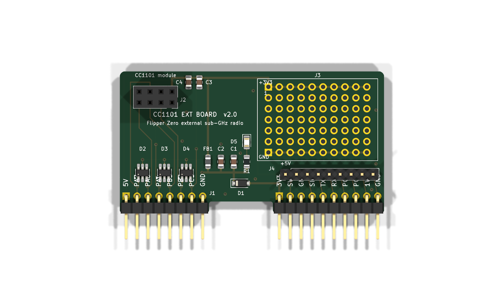

# CC1101 Ext Board V2

A Flipper Zero GPIO carrier for the common 8-pin CC1101 sub-GHz module, with a
prototyping area and a breakout for the Flipper signals the radio does not use.

61.34 × 32.84 mm, two layers, hand-solderable throughout (0805 passives, SOT-23-6,
SOD-123). ERC and DRC are clean; the only remaining DRC entries are silkscreen
overlap warnings where a connector's own pin labels sit close to its pads.



## Wiring

The Flipper Zero GPIO is a **single row of 18 pins**, split into an 8-pin group
(pins 1–8) and a 10-pin group (pins 9–18) with a 17.78 mm gap, 58.42 mm from
pad 1 to pad 18. J1 is the full 18-pin right-angle male header, so its pins bend
down past the mating edge into the Flipper's female sockets and the board lies in
the plane of the GPIO field.

| Flipper pin | Signal | Net on this board | CC1101 module | Notes |
|---|---|---|---|---|
| 1 | +5V | `+5V` | — | Breakout J4 pin 1 only. Off by default; enable it in the GPIO menu. |
| 2 | PA7 | `/MOSI` | MOSI (6) | Clamped by D2 |
| 3 | PA6 | `/MISO` | MISO (7) | Clamped by D2 |
| 4 | PA4 | `/CSN` | CSN (4) | Clamped by D3 |
| 5 | PB3 | `/SCK` | SCK (5) | Clamped by D3 |
| 6 | PB2 | `/GDO0` | GDO0 (3) | Clamped by D4 |
| 7 | PC3 | `/GDO2` | GDO2 (8) | Clamped by D4. V1 left this pin unused. |
| 8 | GND | `GND` | GND (1) | |
| 9 | +3V3 | `+3V3` | — | The only supply the radio uses. 1.2 A available. |
| 10 | SWC | `/SWC` | — | Breakout J4 pin 2 |
| 11 | GND | `GND` | — | |
| 12 | SIO | `/SIO` | — | Breakout J4 pin 3 |
| 13 | TX | `/TX` | — | Breakout J4 pin 4 |
| 14 | RX | `/RX` | — | Breakout J4 pin 5 |
| 15 | PC1 | `/PC1` | — | Breakout J4 pin 6 |
| 16 | PC0 | `/PC0` | — | Breakout J4 pin 7 |
| 17 | 1W | `/1W` | — | Breakout J4 pin 8 |
| 18 | GND | `GND` | — | Breakout J4 pin 9 |

All eighteen pads carry a net. No power pin is silenced with a no-connect flag.

## Power tree

```
J1.9 (+3V3, from the Flipper)
  └─ D1  PMEG2010EH        series Schottky, reverse and back-feed protection
      └─ +3V3_SYS          C1 10 µF, C2 100 nF, R1+D5 indicator, ESD array rails
          └─ FB1 600 R @ 100 MHz
              └─ +3V3_RF   C3 10 µF, C4 100 nF, J2 pin 2 (module VCC),
                           and the proto-area +3V3 rail
```

There is no regulator and no zener. The CC1101 operates from 1.8 V to 3.6 V with
an absolute maximum of 3.9 V, so the Flipper's own 3.3 V rail is the correct
supply; output power is set by PATABLE, not by supply voltage. Budget about
0.25 V of drop across D1 at the module's ~35 mA transmit current, leaving roughly
3.05 V at the socket.

## Using it

1. Plug the CC1101 module into J2. Pin 1 (GND) is the square pad, marked on the
   silkscreen; the module hangs over the board, clear of the 0805 passives.
2. Fit the board onto the Flipper's GPIO sockets. The 8 + 10 split is
   self-keying — it will not mate rotated.
3. On the Flipper: **Sub-GHz → Radio Settings → Module: External**.
4. D5 lights when the board has power. Nothing needs the +5V pin.

## Bill of materials

| Ref | Value | Package | Purpose |
|---|---|---|---|
| J1 | Flipper Zero GPIO | 1×08 + 1×10 right-angle **male pin header**, 2.54 mm | Plugs into the Flipper's female GPIO sockets |
| J2 | CC1101 module | 2×04 socket, 2.54 mm | Radio module |
| J3 | 50 pads, 2.54 mm | THT grid | Prototyping area, +3V3 and GND rails |
| J4 | Spare pins | 1×09 header, 2.54 mm | Breakout: +5V, SWC, SIO, TX, RX, PC1, PC0, 1W, GND |
| D1 | PMEG2010EH | SOD-123 | Series Schottky |
| D2–D4 | SRV05-4 | SOT-23-6 | ESD rail-clamp arrays, ~3 pF per line |
| D5 | LED (red) | 0805 | Power indicator |
| FB1 | 600 R @ 100 MHz | 0805 | Radio supply filter |
| C1, C3 | 10 µF | 0805 | Bulk, each side of FB1 |
| C2, C4 | 100 nF | 0805 | HF decoupling, each side of FB1 |
| R1 | 1 kΩ | 0805 | LED series resistor (~1.5 mA) |

`doc/bom.csv` is the generated version. J1 is **male** right-angle headers —
the Flipper Zero's GPIO is female. J2 is a female socket, because the CC1101
module has male pins.

## What changed from V1

Driven by the V1 design review. Every fix and the one finding that turned out to
be wrong:

| Errata item | V2 |
|---|---|
| PWR·1 reversed 3.6 V zener | Deleted. The Flipper regulates this rail. |
| PWR·2 regulator input and output on one net | LF33 deleted; the radio runs from Flipper pin 9. |
| PWR·3 radio fed from +5V | Supply is now pin 9 (+3V3) through D1 and FB1. |
| PWR·4 10 Ω LED resistor | R1 = 1 kΩ, about 1.5 mA. |
| **CONN·1 "connector cannot mate"** | **Wrong finding.** The Flipper GPIO really is one row of 18 split 8 + 10 over 58.42 mm, exactly as V1 had it. There is no 2×09 header. V1's connector geometry was correct and V2 keeps it. |
| SYNC·1 headers unannotated and unlinked | One annotated `J1` from the schematic, with a `path` back to its symbol. Schematic-parity check passes. |
| SYNC·2 no supply or ground return in the schematic | J1's supply pins are typed `power_out`; a PWR_FLAG marks the ground return. No no-connects on power pins. |
| SYNC·3 netless tracks and vias | Every track and via carries a net. Both prototyping rails are real nets that DRC checks. |
| MECH·1 prototyping grid off 0.1 inch | One footprint, true 2.54 mm in both axes, 10 × 5 pads plus two 10-pad rails. |
| FAB·1 objects outside the outline | Nothing outside the outline; copper-to-edge is an error at 0.3 mm. |
| FAB·2 zeroed design rules | Real rules: 0.15 mm clearance and track, 0.3 mm hole and edge, 0.05 mm mask expansion, 0.25 mm mask sliver. |
| BOM·1 LF33 symbol/value/footprint disagree | Regulator gone. Every remaining part's symbol, value and footprint agree. |
| GND·1 one ground pin, half a pour | All three Flipper grounds connected, GND poured on both layers with 10 stitching vias. |
| FUNC·1 GDO2 unused | GDO2 → Flipper pin 7 (PC3). |
| DOC·1 README overstates protection | This file: real wiring table, real protection, and the *Module: External* step. |
| REPO·1 generated files committed | `.gitignore` added at the repo root. Fab and documentation outputs are committed under `fab/` and `doc/`. |
| Rework step 3, ESD | Three SRV05-4 arrays, two channels each, so every clamp sits within about 2 mm of its connector pin. Six spare channels. |
| Rework step 7, current KiCad | KiCad 10 project throughout. |

## Layout notes and liberties taken

- **Mechanical reference.** J1's footprint is `FLIPPER-GPIO-18-RA` from
  [kbembedded/flipper-gpio-eda](https://github.com/kbembedded/flipper-gpio-eda)
  (BSD-2-Clause, see `library/LICENSE.flipper-gpio-eda`), which carries Flipper's
  own recommended board-edge profile on `User.Drawings`. The board outline traces
  it: the mating edge sits 3.84 mm below the pin row under each connector group
  and steps back to 1.24 mm across the gap, with 0.5 mm corner rounds.
  **Dry-fit before ordering** — the profile is from Flipper's published
  blueprint, not from a measured device.
- **3D models on J1.** Two edits to the upstream footprint, so the 3D preview is
  usable as a mechanical check. Upstream references a single eight-way model,
  unrotated, which lies *across* the pad row and covers only pads 1 and 9;
  replaced with both `PinHeader_1x08` and `PinHeader_1x10_P2.54mm_Horizontal` on
  the KiCad 10 model path, each rotated +90° about Z and offset by its own
  pin-field length. The rotation is needed because KiCad's standard 1×NN
  footprints run their pads along Y with the body on +X, while this footprint
  runs its pads along X with the body toward the mating edge; the offset slides
  each bar back over its own pads, since +90° also maps the pad axis onto −X.
  The only residual is that the pin-1 chamfer lands at the far end of each bar,
  which the square pad and silkscreen already mark correctly. The pads
  themselves were always a single row — this was a preview-only defect.
- **ESD split three ways.** A single SRV05-4 has its four I/O pads on only two
  x positions, which forces the SPI traces to cross to reach it. Three arrays let
  every tap be a straight stub off the connector pin, which is also what the
  part's own placement guidance asks for. The cost is six unused channels.
- **Series Schottky.** The errata asks for one. It is worth noting that the
  8 + 10 split makes a rotated mis-plug physically impossible, so D1's real value
  is blocking the board's 20 µF of bulk from back-feeding the Flipper's rail and
  surviving a partial insertion. If the 0.25 V drop matters more than that,
  fit a 0 Ω link in its place.
- **Module orientation.** J2 is placed so the module can overhang the top edge or
  lie over the board; nothing on the board is taller than 0.7 mm, and the socket
  raises the module about 8.5 mm. Which way the module body points depends on the
  module, so this has not been verified against a physical part.
- **Ground pour on both layers.** Signals are on F.Cu; +5V, and the three nets
  whose routing order does not match the module's pinout (`/CSN`, `/GDO2`, and the
  ESD rail feed), use short B.Cu runs.

## Files

```
CC1101ExtBoardV2.kicad_pro/_sch/_pcb   the design
library/CC1101ExtBoardV2.kicad_sym     project symbols
library/CC1101ExtBoardV2.pretty        project footprints
doc/                                   ERC, DRC, schematic PDF, renders, BOM, netlist
fab/                                   gerbers + drill (zipped), positions, STEP
build-outputs.sh                       regenerates everything in doc/ and fab/
```

`./build-outputs.sh` needs `kicad-cli` 10.x; it falls back to a
`~/.local/bin/kicad-*.AppImage` if `kicad-cli` is not on `PATH`, or set
`KICAD_CLI` yourself.
